# Database Schema - AI Trip Planner

## Entity Relationship Diagram

```mermaid
erDiagram
    users ||--o{ trips : creates
    users ||--o{ reviews : writes
    users ||--o{ referrals : makes
    users ||--o{ wallet_transactions : has
    
    trips ||--|| itineraries : contains
    trips ||--o{ bookings : includes
    trips ||--o{ trip_collaborators : shares_with
    
    itineraries ||--o{ itinerary_days : has
    itinerary_days ||--o{ itinerary_items : contains
    
    itinerary_items }o--|| pois : references
    bookings }o--|| vendors : booked_through
    reviews }o--|| pois : rates
    
    pois ||--o{ poi_images : has
    pois ||--o{ poi_hours : operates_during
    pois }o--|| destinations : located_in
    
    users {
        uuid id PK
        string email UK
        string password_hash
        string full_name
        string phone
        jsonb preferences
        string currency_code
        string locale
        timestamp created_at
        timestamp updated_at
        timestamp last_active_at
        boolean email_verified
        string referral_code UK
    }
    
    trips {
        uuid id PK
        uuid user_id FK
        string title
        string destination_name
        point destination_coordinates
        date start_date
        date end_date
        int party_size
        decimal budget_min
        decimal budget_max
        string currency
        enum status
        jsonb metadata
        timestamp created_at
        timestamp updated_at
    }
    
    itineraries {
        uuid id PK
        uuid trip_id FK
        boolean is_ai_generated
        jsonb ai_prompt_data
        int version
        jsonb locked_items
        timestamp generated_at
        timestamp last_modified
    }
    
    itinerary_days {
        uuid id PK
        uuid itinerary_id FK
        int day_number
        date date
        string theme
        text notes
        jsonb weather_data
    }
    
    itinerary_items {
        uuid id PK
        uuid day_id FK
        uuid poi_id FK
        enum type
        time start_time
        time end_time
        int duration_minutes
        decimal estimated_cost
        string currency
        int sort_order
        boolean is_locked
        uuid booking_id FK
        jsonb custom_notes
    }
    
    pois {
        uuid id PK
        uuid destination_id FK
        string name
        text description
        point coordinates
        string address
        string[] categories
        string[] tags
        jsonb contact_info
        jsonb pricing_info
        decimal avg_rating
        int review_count
        jsonb metadata
        vector embedding
        timestamp created_at
        timestamp updated_at
    }
    
    destinations {
        uuid id PK
        string name
        string country
        string region
        point coordinates
        string timezone
        jsonb visa_requirements
        jsonb best_months
        jsonb local_currency
        text description
        vector embedding
        timestamp created_at
    }
    
    bookings {
        uuid id PK
        uuid trip_id FK
        uuid vendor_id FK
        string external_booking_id
        enum type
        enum status
        decimal amount
        string currency
        jsonb booking_details
        jsonb confirmation_data
        string documents_url
        timestamp booked_at
        timestamp check_in_at
        timestamp check_out_at
        timestamp cancelled_at
    }
    
    vendors {
        uuid id PK
        string name
        enum type
        string api_endpoint
        jsonb api_credentials
        decimal commission_rate
        string[] supported_regions
        boolean is_active
        jsonb contact_info
        timestamp created_at
    }
    
    reviews {
        uuid id PK
        uuid user_id FK
        uuid poi_id FK
        uuid trip_id FK
        int rating
        text content
        string[] uploaded_images
        jsonb aspect_scores
        jsonb ai_analysis
        boolean is_verified
        int helpful_votes
        timestamp created_at
        timestamp updated_at
    }
    
    wallet_transactions {
        uuid id PK
        uuid user_id FK
        enum type
        decimal amount
        string currency
        string description
        jsonb metadata
        timestamp created_at
    }
    
    referrals {
        uuid id PK
        uuid referrer_id FK
        uuid referee_id FK
        string referral_code
        enum status
        decimal reward_amount
        timestamp created_at
        timestamp completed_at
    }
```



## Core Tables Definition

### 1. Users Table
```sql
CREATE TABLE users (
    id UUID PRIMARY KEY DEFAULT gen_random_uuid(),
    email VARCHAR(255) UNIQUE NOT NULL,
    password_hash VARCHAR(255) NOT NULL,
    full_name VARCHAR(255),
    phone VARCHAR(20),
    preferences JSONB DEFAULT '{}',
    currency_code VARCHAR(3) DEFAULT 'INR',
    locale VARCHAR(10) DEFAULT 'en-IN',
    created_at TIMESTAMPTZ DEFAULT now(),
    updated_at TIMESTAMPTZ DEFAULT now(),
    last_active_at TIMESTAMPTZ,
    email_verified BOOLEAN DEFAULT false,
    referral_code VARCHAR(20) UNIQUE
);

CREATE INDEX idx_users_email ON users(email);
CREATE INDEX idx_users_referral_code ON users(referral_code);
CREATE INDEX idx_users_created_at ON users(created_at);
```

### 2. Trips Table
```sql
CREATE TABLE trips (
    id UUID PRIMARY KEY DEFAULT gen_random_uuid(),
    user_id UUID NOT NULL REFERENCES users(id) ON DELETE CASCADE,
    title VARCHAR(255) NOT NULL,
    destination_name VARCHAR(255) NOT NULL,
    destination_coordinates POINT,
    start_date DATE NOT NULL,
    end_date DATE NOT NULL,
    party_size INTEGER DEFAULT 1 CHECK (party_size > 0),
    budget_min DECIMAL(10,2),
    budget_max DECIMAL(10,2),
    currency VARCHAR(3) DEFAULT 'INR',
    status VARCHAR(20) DEFAULT 'draft' CHECK (status IN ('draft', 'planned', 'confirmed', 'active', 'completed', 'cancelled')),
    metadata JSONB DEFAULT '{}',
    created_at TIMESTAMPTZ DEFAULT now(),
    updated_at TIMESTAMPTZ DEFAULT now()
);

CREATE INDEX idx_trips_user_id ON trips(user_id);
CREATE INDEX idx_trips_status ON trips(status);
CREATE INDEX idx_trips_dates ON trips(start_date, end_date);
CREATE INDEX idx_trips_destination ON trips USING GiST(destination_coordinates);
```

### 3. POIs (Points of Interest) Table
```sql
CREATE TABLE pois (
    id UUID PRIMARY KEY DEFAULT gen_random_uuid(),
    destination_id UUID REFERENCES destinations(id),
    name VARCHAR(255) NOT NULL,
    description TEXT,
    coordinates POINT NOT NULL,
    address TEXT,
    categories TEXT[] DEFAULT '{}',
    tags TEXT[] DEFAULT '{}',
    contact_info JSONB DEFAULT '{}',
    pricing_info JSONB DEFAULT '{}',
    avg_rating DECIMAL(3,2) DEFAULT 0,
    review_count INTEGER DEFAULT 0,
    metadata JSONB DEFAULT '{}',
    embedding VECTOR(1536), -- For AI similarity search
    created_at TIMESTAMPTZ DEFAULT now(),
    updated_at TIMESTAMPTZ DEFAULT now()
);

CREATE INDEX idx_pois_coordinates ON pois USING GiST(coordinates);
CREATE INDEX idx_pois_categories ON pois USING GIN(categories);
CREATE INDEX idx_pois_rating ON pois(avg_rating DESC);
CREATE INDEX idx_pois_embedding ON pois USING ivfflat (embedding vector_cosine_ops);
```

## Advanced Features Schema

### Vector Search for AI Recommendations
```sql
-- Enable pgvector extension
CREATE EXTENSION IF NOT EXISTS vector;

-- Semantic search function
CREATE OR REPLACE FUNCTION search_similar_pois(
    query_embedding VECTOR(1536),
    limit_count INTEGER DEFAULT 10,
    similarity_threshold DOUBLE PRECISION DEFAULT 0.8
)
RETURNS TABLE(poi_id UUID, similarity DOUBLE PRECISION)
LANGUAGE SQL
AS $$
    SELECT id, 1 - (embedding <=> query_embedding) as similarity
    FROM pois
    WHERE 1 - (embedding <=> query_embedding) > similarity_threshold
    ORDER BY embedding <=> query_embedding
    LIMIT limit_count;
$$;
```

### Analytics Schema
```sql
CREATE TABLE user_events (
    id UUID PRIMARY KEY DEFAULT gen_random_uuid(),
    user_id UUID REFERENCES users(id),
    session_id VARCHAR(255),
    event_name VARCHAR(100) NOT NULL,
    properties JSONB DEFAULT '{}',
    device_info JSONB DEFAULT '{}',
    timestamp TIMESTAMPTZ DEFAULT now()
);

CREATE INDEX idx_events_user_time ON user_events(user_id, timestamp DESC);
CREATE INDEX idx_events_name ON user_events(event_name);
CREATE INDEX idx_events_session ON user_events(session_id);

-- Partitioning by month for performance
SELECT partman.create_parent(
    p_parent_table => 'public.user_events',
    p_control => 'timestamp',
    p_type => 'range',
    p_interval => 'monthly'
);
```

### Booking Integration Schema
```sql
CREATE TABLE vendor_mappings (
    id UUID PRIMARY KEY DEFAULT gen_random_uuid(),
    vendor_id UUID REFERENCES vendors(id),
    external_poi_id VARCHAR(255),
    our_poi_id UUID REFERENCES pois(id),
    mapping_confidence DECIMAL(3,2),
    last_synced_at TIMESTAMPTZ,
    is_active BOOLEAN DEFAULT true
);

CREATE UNIQUE INDEX idx_vendor_mappings_external ON vendor_mappings(vendor_id, external_poi_id);
```

## Performance Optimizations

### Indexing Strategy
```sql
-- Composite indexes for common queries
CREATE INDEX idx_trips_user_status_dates ON trips(user_id, status, start_date);
CREATE INDEX idx_bookings_trip_status ON bookings(trip_id, status);
CREATE INDEX idx_reviews_poi_rating ON reviews(poi_id, rating DESC);

-- GiST indexes for geographical queries
CREATE INDEX idx_pois_location_categories ON pois USING GiST(coordinates, categories);

-- GIN indexes for JSON queries
CREATE INDEX idx_users_preferences ON users USING GIN(preferences);
CREATE INDEX idx_pois_metadata ON pois USING GIN(metadata);
```

### Query Optimization
```sql
-- Materialized view for popular destinations
CREATE MATERIALIZED VIEW popular_destinations AS
SELECT 
    d.id,
    d.name,
    d.country,
    COUNT(t.id) as trip_count,
    AVG(r.rating) as avg_rating,
    COUNT(r.id) as review_count
FROM destinations d
LEFT JOIN trips t ON ST_DWithin(d.coordinates::geography, t.destination_coordinates::geography, 50000)
LEFT JOIN reviews r ON r.poi_id IN (
    SELECT poi.id FROM pois poi WHERE ST_DWithin(d.coordinates::geography, poi.coordinates::geography, 50000)
)
WHERE t.created_at > CURRENT_DATE - INTERVAL '1 year'
GROUP BY d.id, d.name, d.country
ORDER BY trip_count DESC, avg_rating DESC;

CREATE UNIQUE INDEX idx_popular_destinations_id ON popular_destinations(id);
REFRESH MATERIALIZED VIEW CONCURRENTLY popular_destinations;
```

## Data Migration Strategy

### Version Control
```sql
CREATE TABLE schema_migrations (
    version VARCHAR(255) PRIMARY KEY,
    applied_at TIMESTAMPTZ DEFAULT now(),
    execution_time_ms INTEGER,
    checksum VARCHAR(64)
);
```

### Backup Strategy
- **Full Backups**: Daily automated backups with 30-day retention
- **Point-in-Time Recovery**: 7-day PITR window
- **Cross-Region Replication**: Disaster recovery in different AZ
- **Testing**: Monthly backup restoration tests