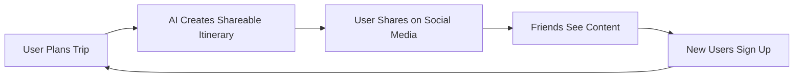
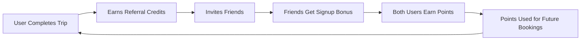
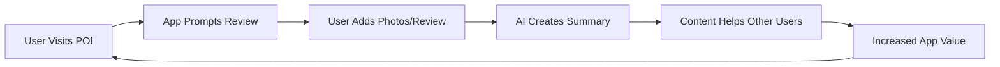

# Growth Strategy - AI Trip Planner Super-App

## Growth Philosophy: Community-Driven Viral Loops

Our growth strategy centers on creating **natural sharing moments** throughout the travel journey, turning users into advocates through exceptional AI-powered experiences.

---

## 🎯 Target Market Segmentation

### Primary Market: Digital-Native Travelers (80% focus)
- **Demographics**: 22-35 years, urban, ₹6-25L income
- **Behavior**: 3-5 trips/year, smartphone-first, social media active
- **Pain Points**: Time-consuming research, fragmented booking, budget uncertainty
- **Opportunity Size**: 25M+ travelers in India, growing 15% annually

### Secondary Markets
- **Family Coordinators**: 30-45 years, planning family trips
- **Business Travelers**: Expense management and quick planning needs
- **International Tourists**: Visiting India, need local expertise

---

## 🚀 Growth Engine: Triple Viral Loop System

### Loop 1: Content Virality (Organic Reach)


**Mechanics**:
- **AI-Generated Travel Cards**: Beautiful, shareable itinerary summaries optimized for Instagram/WhatsApp
- **Trip Collaboration**: Friends join trip planning, expanding user base organically
- **Success Stories**: Automated post-trip highlights reel creation

**Target**: 35% of users share trip content, driving 40% of new acquisitions

---

### Loop 2: Referral Rewards (Incentivized Growth)


**Mechanics**:
- **Tiered Rewards**: ₹500 credit for referrer, ₹300 for referee on first booking
- **Streak Bonuses**: Additional rewards for multiple successful referrals
- **VIP Status**: Top referrers get premium features and early access

**Target**: 30% of active users refer at least one friend

---

### Loop 3: UGC & Reviews (Content Moat)


**Mechanics**:
- **Location-Based Prompts**: Smart notifications when user visits booked POIs
- **Photo Challenges**: Gamified photo collection with seasonal themes
- **Review Rewards**: Points for helpful reviews, badges for top contributors

**Target**: 60% of completed trips generate UGC

---

## 📈 Channel Strategy & Tactics

### 1. Content Marketing (40% of acquisition)
**SEO-Optimized Destination Guides**
- 100+ comprehensive city/destination guides
- AI-generated but human-reviewed content  
- Target keywords: "[destination] itinerary", "[city] trip planner"
- **Timeline**: 10 guides/month starting Month 2

**Social Media Content**
- Daily travel tips and destination spotlights (Instagram/YouTube)
- User-generated content amplification
- Travel influencer partnerships (micro-influencers 10K-100K followers)

### 2. Paid Acquisition (35% of acquisition)
**Facebook & Instagram Ads**
- Lookalike audiences based on travel interest data
- Creative focus: AI planning demo videos
- **Budget**: ₹2L/month starting Month 2, scale to ₹10L by Month 6

**Google Ads**
- High-intent keywords: "trip planner india", "[destination] travel guide"
- YouTube ads targeting travel content viewers
- **Budget**: ₹1.5L/month with 15% month-over-month increase

### 3. Partnership & Collaborations (25% of acquisition)
**Travel Influencer Program**
- 50+ micro-influencers (10K-50K followers) create trips using the app
- Authentic trip documentation with promo codes
- **Compensation**: Free premium + ₹5K per campaign

**Corporate Partnerships**
- HR partnerships for employee travel benefits
- Startup community partnerships (offer team trip planning)
- University campus ambassador programs

---

## 🎮 Gamification & Retention Strategy

### Points & Rewards System
```
User Actions → Points Earned:
- Complete profile: 100 points
- Plan first trip: 200 points  
- Complete booking: 500 points
- Write review: 150 points
- Upload photos: 50 points per photo
- Successful referral: 1000 points
```

**Point Redemption**:
- 1000 points = ₹100 booking credit
- 2500 points = 1 month premium upgrade
- 5000 points = VIP customer service access

### Achievement Badges
- **Explorer**: Plan 3 trips
- **Adventurer**: Visit 5 different states
- **Foodie**: Try 10 local restaurants  
- **Photographer**: Upload 50+ photos
- **Guru**: Get 100+ helpful votes on reviews

### Leaderboards & Social Features
- Monthly travel challenges (e.g., "Offbeat Destinations")
- Local city leaderboards for top contributors
- Annual "Traveler of the Year" recognition

---

## 📱 App Store Optimization (ASO)

### Keyword Strategy
**Primary Keywords**:
- "AI trip planner"
- "Travel itinerary maker"  
- "India travel guide"
- "Budget trip planner"

**Long-tail Keywords**:
- "AI powered travel planning app"
- "Automatic itinerary generator India"
- "Smart budget travel organizer"

### App Store Assets
- **Icon**: Clean, recognizable travel symbol with AI element
- **Screenshots**: Focus on AI conversation and beautiful itinerary design
- **Video Preview**: 30-second AI planning demo
- **Description**: Lead with AI benefits, include social proof

**Target**: Top 5 ranking in "Travel" category within 6 months

---

## 🤝 Strategic Partnership Pipeline

### Travel Industry Partnerships
**Immediate (Month 1-2)**:
- Booking.com affiliate partnership
- Razorpay payment integration
- Google Maps Platform partnership

**Medium-term (Month 3-6)**:
- Direct hotel partnerships (OYO, Treebo, boutique chains)
- Activity provider partnerships (local tour operators)
- Transportation partnerships (bus aggregators, cab companies)

**Long-term (Month 6+)**:
- Airline partnerships for inventory access
- Travel insurance company partnerships  
- Destination marketing board collaborations

### Technology Partnerships
- **OpenAI**: Preferred partner rates for API usage
- **AWS**: Startup credits and technical support
- **Mixpanel/Amplitude**: Analytics platform partnerships

---

## 📊 Growth Metrics & KPIs

### User Acquisition Metrics
- **Target**: 10K downloads in Month 1, 50K by Month 3
- **Cost per Install (CPI)**: <₹25 for organic, <₹150 for paid
- **Install-to-Registration**: >50% conversion rate
- **Registration-to-First-Trip**: >40% within 7 days

### Engagement Metrics  
- **Daily Active Users**: 15% of monthly active users
- **Session Duration**: >5 minutes average
- **Trip Completion Rate**: >60% of started trips get completed
- **Booking Conversion**: >25% of planned trips include bookings

### Viral Metrics
- **K-factor**: Target 0.5 (each user brings 0.5 additional users)
- **Referral Conversion**: >15% of referred users complete first trip
- **Content Shares**: >20% of trips get shared on social media

### Revenue Metrics
- **Average Revenue Per User**: ₹800 in Year 1
- **Customer Lifetime Value**: ₹2,000 over 24 months
- **Monthly Recurring Revenue**: ₹5L by Month 6 (premium subscriptions)

---

## 🎪 Launch Strategy

### Beta Launch (Month 2, Week 3)
- **Audience**: 500 travel enthusiasts from personal networks
- **Duration**: 3 weeks of intensive feedback collection
- **Goal**: Validate core value proposition and fix major UX issues

### Public Launch (Month 3, Week 2)
- **Soft Launch**: Android-first in 5 major Indian cities
- **Media Strategy**: Tech blogs, travel publications, podcast interviews
- **Community Building**: Travel Facebook groups, Reddit travel communities

### Post-Launch (Month 3, Week 4)
- **iOS Launch**: Simultaneous with major marketing campaign
- **PR Strategy**: Founder interviews, product hunt launch
- **Scale Marketing**: Increase ad spend based on validated unit economics

---

## 🔄 Iteration & Optimization Framework

### Weekly Growth Reviews
- **Monday**: Metric review and weekly goal setting
- **Wednesday**: User feedback analysis and feature prioritization  
- **Friday**: A/B test results and optimization decisions

### Monthly Strategic Reviews
- **User Research**: 10+ user interviews per month
- **Competitive Analysis**: Track competitor features and pricing
- **Partnership Pipeline**: Evaluate new partnership opportunities

### Quarterly Deep Dives
- **Market Analysis**: Expand to new user segments or geographies
- **Product Roadmap**: Plan next 90 days based on learnings
- **Team Scaling**: Hire based on validated growth channels

**Success Metric**: 40% month-over-month user growth sustained for 6 months**