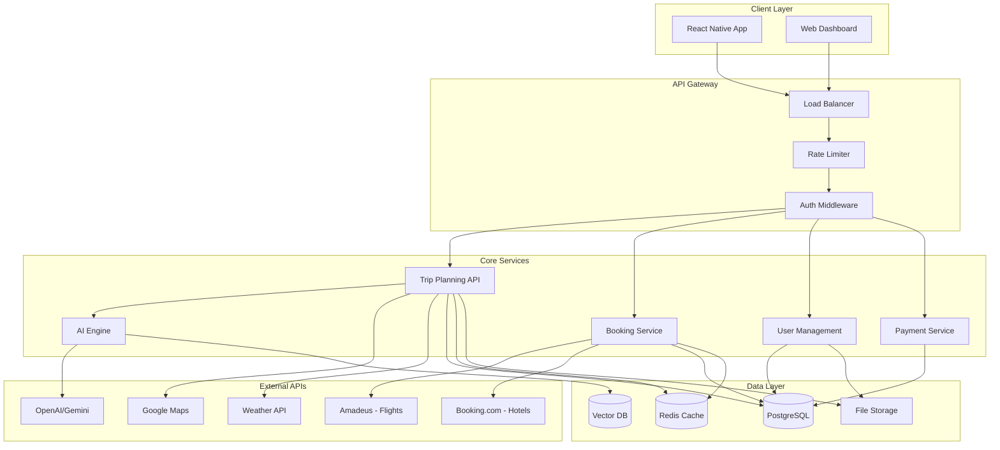
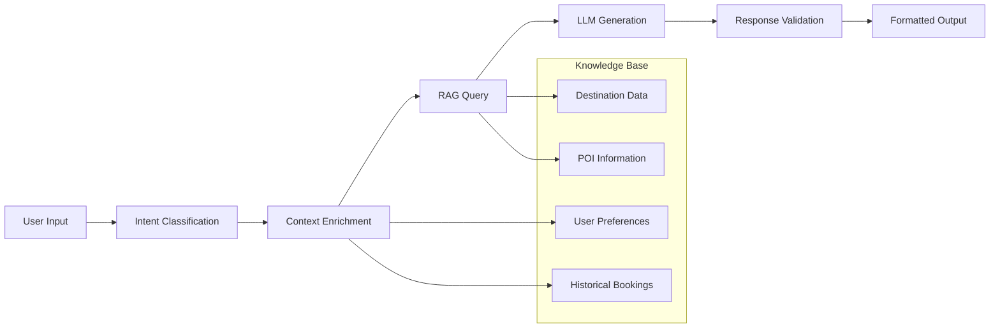
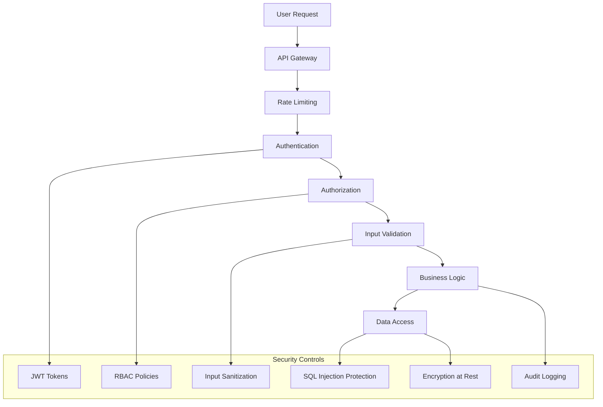

# System Architecture - AI Trip Planner

## High-Level Architecture



## Component Architecture

### 1. Mobile Application (React Native + Expo)
```
src/
├── screens/           # Screen components
│   ├── onboarding/
│   ├── discovery/
│   ├── planning/
│   ├── booking/
│   └── profile/
├── components/        # Reusable UI components
├── services/          # API clients and business logic
├── store/             # State management (Zustand)
├── utils/             # Helper functions
├── types/             # TypeScript definitions
└── constants/         # App configuration
```

### 2. Backend Services (Node.js + TypeScript)

#### Core API Service
```typescript
// Microservices Architecture
services/
├── gateway/           # API Gateway with authentication
├── trip-planning/     # Trip creation and management
├── booking/           # Partner API integration
├── user/              # User management and preferences  
├── payment/           # Payment processing
├── ai/                # AI inference and RAG
├── notification/      # Push and email notifications
└── analytics/         # Event tracking and insights
```

#### Service Communication
- **Synchronous**: REST APIs for real-time operations
- **Asynchronous**: Message queues (BullMQ + Redis) for background tasks
- **Event Streaming**: Event-driven architecture for cross-service communication

### 3. AI & ML Pipeline



#### RAG Implementation
- **Vector Database**: pgvector for semantic search
- **Embeddings**: OpenAI text-embedding-ada-002
- **Retrieval**: Hybrid search (vector + keyword + filters)
- **Generation**: GPT-4 with custom prompts and constraints

### 4. Data Architecture

#### Database Schema (PostgreSQL)
```sql
-- Core entities with relationships
users (id, profile_data, preferences_json, created_at)
trips (id, user_id, destination, dates, budget, status)
itineraries (id, trip_id, ai_generated, locked_items)
bookings (id, trip_id, vendor, type, status, amount)
pois (id, name, location, categories, ratings)
reviews (id, user_id, poi_id, content, sentiment_scores)
```

#### Caching Strategy
- **Redis Layers**:
  - L1: API response cache (TTL: 5-15 minutes)
  - L2: User session data (TTL: 24 hours)  
  - L3: Computed itineraries (TTL: 7 days)
  - L4: Static content cache (TTL: 1 hour)

### 5. Security Architecture



## 6. Scalability Patterns

### Horizontal Scaling
- **Stateless Services**: All services designed for horizontal scaling
- **Database Sharding**: Partition by user_id for trip/booking data
- **CDN Distribution**: Global edge caching for static content
- **Auto-scaling**: Kubernetes-based container orchestration

### Performance Optimization
- **Database**: Read replicas, query optimization, connection pooling
- **Caching**: Multi-layer cache hierarchy with intelligent invalidation
- **API**: GraphQL for efficient data fetching, pagination for large datasets
- **Mobile**: Lazy loading, image optimization, offline-first architecture

## 7. Monitoring & Observability

### Application Monitoring
- **APM**: New Relic for performance monitoring
- **Logging**: Structured logging with ELK stack
- **Metrics**: Prometheus + Grafana for system metrics
- **Alerting**: PagerDuty for critical issue escalation

### Business Intelligence
- **Analytics**: Mixpanel for user behavior tracking
- **A/B Testing**: Feature flags for controlled rollouts
- **Revenue Tracking**: Custom dashboard for booking metrics
- **User Feedback**: In-app rating and review collection

## 8. Deployment Strategy

### Infrastructure (AWS/GCP)
```yaml
Production Environment:
  - API Gateway: AWS ALB + CloudFront
  - Compute: EKS cluster with auto-scaling node groups
  - Database: RDS PostgreSQL Multi-AZ
  - Cache: ElastiCache Redis cluster
  - Storage: S3 for images, CloudWatch for logs
  - Monitoring: New Relic, CloudWatch, Prometheus
```

### CI/CD Pipeline
1. **Development**: Feature branch → automated testing
2. **Staging**: Main branch → integration tests + manual QA
3. **Production**: Tagged release → blue-green deployment
4. **Rollback**: Instant rollback capability for critical issues

### Release Strategy
- **Phased Rollout**: 5% → 25% → 50% → 100% user traffic
- **Feature Flags**: Gradual feature enabling with kill switches
- **Database Migrations**: Zero-downtime schema changes
- **Mobile Releases**: Coordinated with app store approval timelines